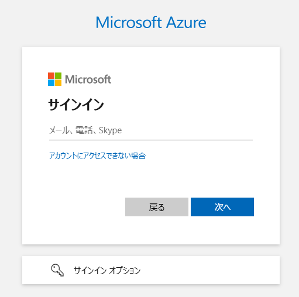
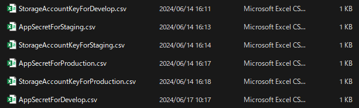

## 概要

このPowerShellスクリプトは、Azureでのバックエンドリソースを自動でデプロイします。
具体的には以下のリソースがデプロイされます。

- リソースグループ
- GitHub Action用エンタープライズアプリケーション
- ストレージアカウント
- ロールの割り当て
- GitHub Actionsを通じてAzureに接続するための[ワークロードIDフェデレーション](https://learn.microsoft.com/ja-jp/entra/workload-id/workload-identity-federation)の設定

また、ストレージアカウンの接続キー、エンタープライズアプリケーションのシークレットをcsv形式で出力します。

## 前提条件

- `Az` PowerShellモジュールがインストールされていること
インストール手順については以下を参照
[インストール - Windows](https://learn.microsoft.com/ja-jp/powershell/azure/install-azps-windows?view=azps-12.0.0&tabs=powershell&pivots=windows-psgallery)
[インストール - macOS](https://learn.microsoft.com/ja-jp/powershell/azure/install-azps-macos?view=azps-12.0.0)

- 必要な変数を定義した `Variables.ps1` という名前の変数定義ファイルが同じディレクトリにあること

## 変数

このスクリプトは、同じディレクトリにある `Variables.ps1` ファイルから必要な変数を読み込みます。環境に合わせて、以下の変数の値を設定してください。

- `$Environment`:環境名(develop、staging、productionのいずれか)
- `$SubscriptionId`:AzureのサブスクリプションID
- `$Location`:各種リソースををデプロイするリージョン
- `$StorageAccountName`:tfstateを管理するストレージアカウン名
- `$OrganizationName`:GitHubの組織名
- `$RepositoryNameForContainerProject`:iac-containerのソースコードを管理するレポジトリ名
- `$FilePath`:csvファイルの出力先となるディレクトリ

`$StorageAccountName`については、必要に応じて`stotfstate`を10文字以内の文字列(アルファベット小文字、数字のみ)に変更し、ストレージアカウンの名前の一意性を担保してください。

## 関数
このスクリプトには、以下の関数が定義されています。

- `$CreateResourceGroup`: リソースグループの作成
- `$CreateEnterpriseApplication`: エンタープライズアプリケーションの作成
- `$CreateServicePrincipal`: エンタープライズアプリケーションのサービスプリンシパルの作成
- `$CreateSecret`: アプリケーションの各種シークレットを作成し、CSVファイルにエクスポート
- `$AssignRoleOverResourceGroup`:
- `$CreateStorageAccount`: ストレージアカウントの作成
- `$CreateStorageContainer`: ストレージアカウント内にストレージコンテナの作成
- `$AssignRoleOverStorageContainer`: tfstateファイルのRead/Writeするため、ストレージコンテナに対してサービスプリンシパルにContributorロールの割り当て
- `$AssignRBACAdministerRoleToServicePrincipal`: GitHub Actions経由でKeyVaultへのRead/Wrtite権限を付与するため、サービスプリンシパルにRBAC Adminロールを割り当てます。
- `$AddFederatedCredential`: GitHub Actionsを通じてAzureに接続するためのフェデレーテッドクレデンシャルの追加

## 使用方法
`$Variables.ps1` が正しく設定され、スクリプトと同じディレクトリに配置されていることを確認します。

以下は、スクリプトを実行する手順です。
- PowerShellを開き、スクリプトのディレクトリに移動します：

```
cd path\to\script\directory
```

- スクリプトを実行します。
```
.\DeployBackendResources.ps1
```

- 認証画面が表示されたら、UPN・パスワードを入力する。


- ブラウザを閉じて、Powershell上で実行結果を確認する。

- 各種シークレットが`$FilePath`で定義したディレクトリ配下にcsv形式で出力されていることを確認する。
